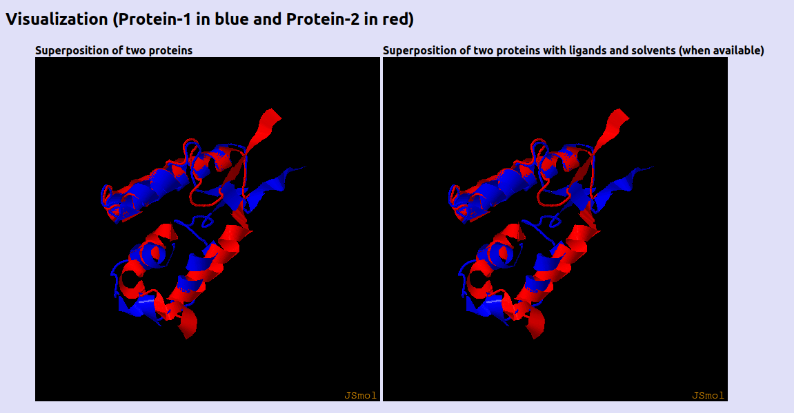
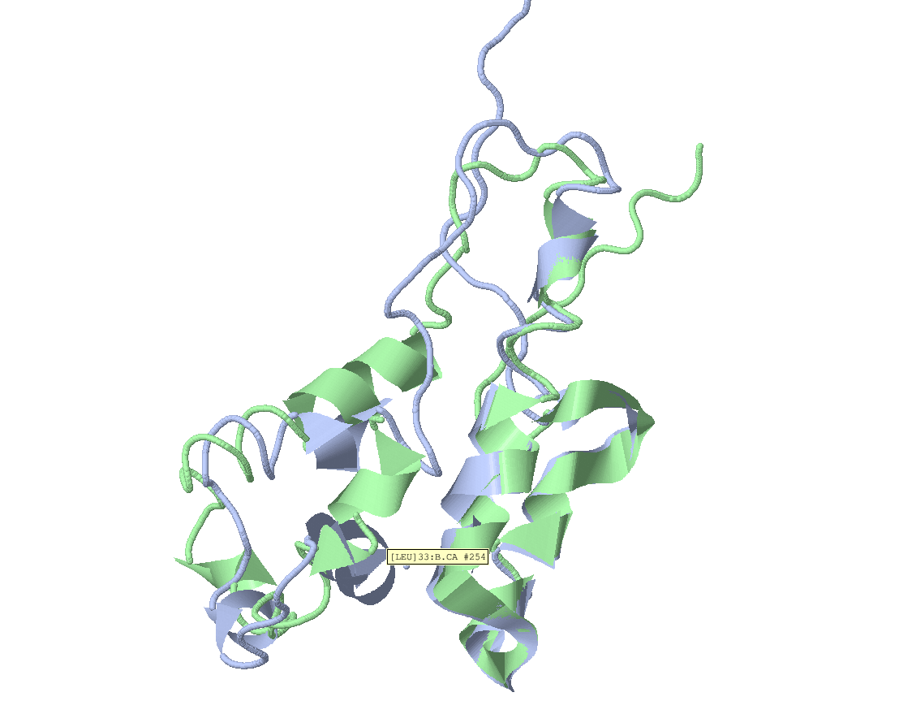
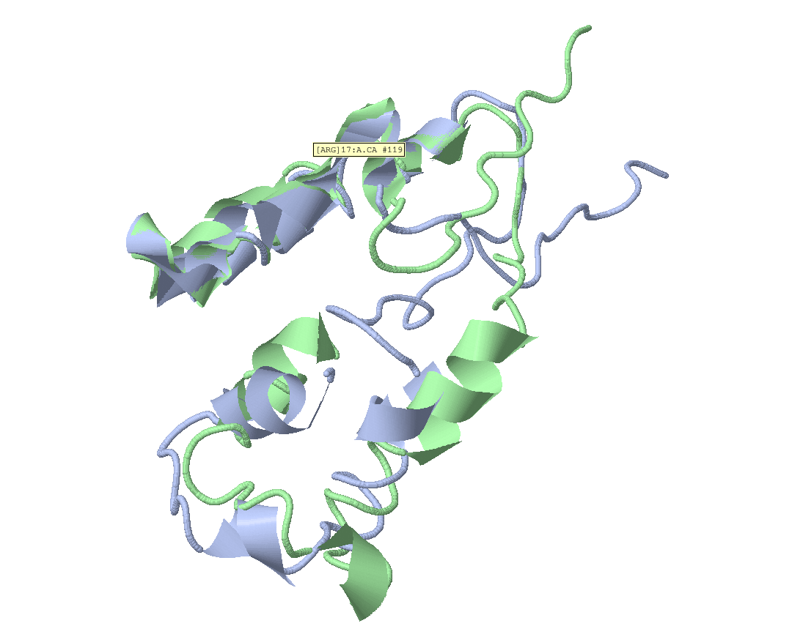

# Homework 6

Последовательность:  
MSTLTSVSGFPRIGQNRELKKIIEGYWKGANDLAAVKATAAELRAKHWRLQQAAGIDLIASNDFSYYDQMLDTAILLNVIPQRYQRLAFDDQEDTLFAMA

Использованные предсказатели структуры белка:
* OmegaFold
* OpenFold

Использованная утилита для выравнивания структур:
* TMAlign

## Результаты выравнивания

```

 **************************************************************************
 *                        TM-align (Version 20190822)                     *
 * An algorithm for protein structure alignment and comparison            *
 * Based on statistics:                                                   *
 *       0.0 < TM-score < 0.30, random structural similarity              *
 *       0.5 < TM-score < 1.00, in about the same fold                    *
 * Reference: Y Zhang and J Skolnick, Nucl Acids Res 33, 2302-9 (2005)    *
 * Please email your comments and suggestions to: zhng@umich.edu          *
 **************************************************************************

Name of Chain_1: A263329                                           
Name of Chain_2: B263329                                           
Length of Chain_1:  100 residues
Length of Chain_2:  100 residues

Aligned length=   83, RMSD=   3.09, Seq_ID=n_identical/n_aligned= 0.735
TM-score= 0.61749 (if normalized by length of Chain_1)
TM-score= 0.61749 (if normalized by length of Chain_2)
(You should use TM-score normalized by length of the reference protein)

(":" denotes aligned residue pairs of d < 5.0 A, "." denotes other aligned residues)
MSTLTS----VS-GFPR-I-GQNRELKKIIEGYWKGANDLAAVKATAAELRAKHWRLQQAAGIDLIASNDF--SYY--DQMLDTAILLNVI---PQRYQRLAFDDQEDTLFAMA---
          .  .::: : ::::::::::::::::::::::::::::::::::::::::::: :::. ..  .    :::::::::::::   ::::: .:: .::: :.      
------MSTLT-SVSGFPRIGQNRELKKIIEGYWKGANDLAAVKATAAELRAKHWRLQQAAGI-DLIA-SNDFS--YYDQMLDTAILLNVIPQRYQRLA-FDD-QEDT-LF---AMA
```



А также сервером были сгенерированы pdb файлы, которые можно найти в папке "Alignments"

## Визуализация

Для визуализации был выбран файл G263329.pdb. Его я открыл в Jmol, выбрал режим отображения Cartoon и цветовую схему Chains.




Экспортировал сессию в файл с названием JMOL_state

## Выводы

Предсказания, если говорить в общем, не сильно отличаются друг от друга. Заметил, что есть участки цепочек, которые очень хорошо выровнены, однако некоторые части структур имеют существенные различия.